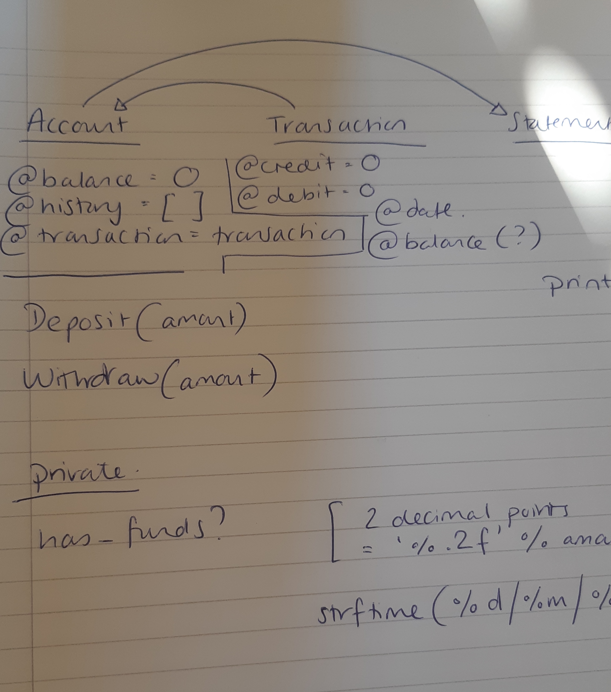
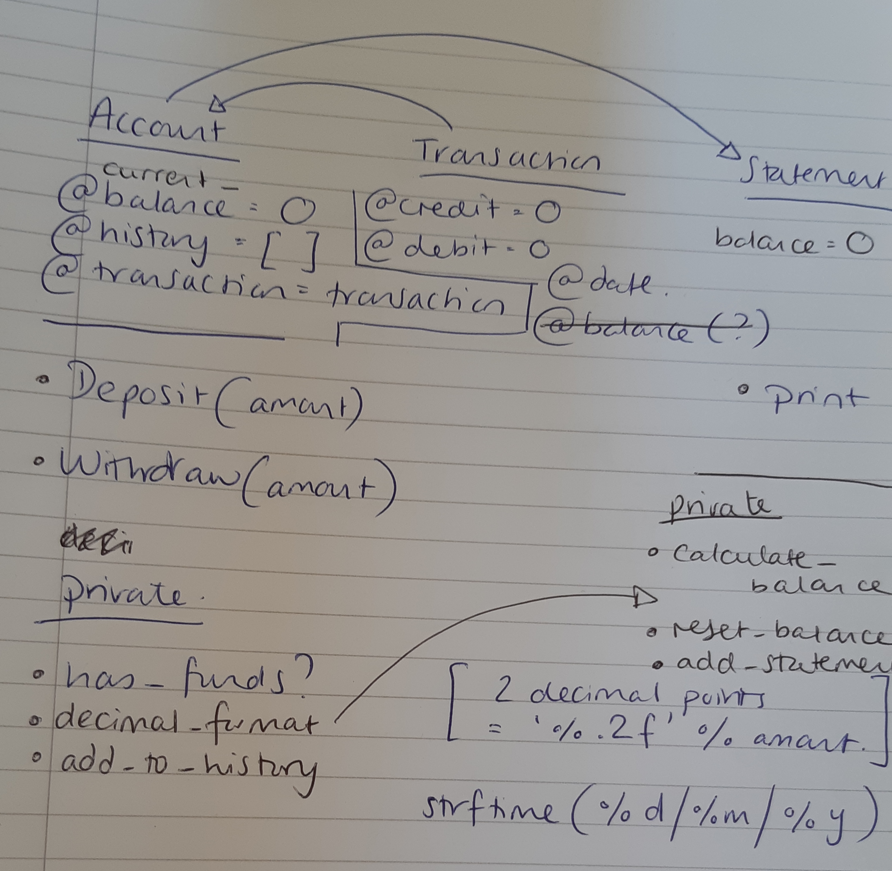

# Bank Tech Test - Ruby

Makers Week 10 Individual Challenges

[](https://travis-ci.com/Kittaru87/bank-tech-test)

[Specification](#Specification) | [Planning](#Planning) | [Installation instructions](#Installation-instructions) | [Running tests](#Running-tests) | [Further development](#Further-development) | [Tech stack](#Tech-stack)

## Specification
Write a program that can be used by irb to simulate a user's interaction with their bank account.

### Requirements

* You should be able to interact with your code via a REPL like IRB or the JavaScript console. (You don't need to implement a command line interface that takes input from STDIN.)
* Deposits, withdrawal.
* Account statement (date, amount, balance) printing.
* Data can be kept in memory (it doesn't need to be stored to a database or anything).

### Acceptance criteria

* Given a client makes a deposit of 1000 on 10-01-2012
* And a deposit of 2000 on 13-01-2012
* And a withdrawal of 500 on 14-01-2012
* When she prints her bank statement she would see:

date || credit || debit || balance

14/01/2012 || || 500.00 || 2500.00

13/01/2012 || 2000.00 || || 3000.00

10/01/2012 || 1000.00 || || 1000.00

### Edge cases
* Should the user be able to withdraw money when they have 0 balance?

## Planning

### user stories
```
As a customer
So that I can save money
I want to be able to deposit money into my account

As a customer
So that I can spend my money
I want to be able to withdraw money from my account

As a customer
So I may have a better understanding of my financial outgoings
I want to be able to see a printed statement of my withdrawals and deposits (newest first)
```
### Model



## Installation instructions

* git clone https://github.com/Kittaru87/bank-tech-test.git
* cd bank-tech-test
* `bundle install` - install gem file

## Running tests

* `rspec --init` - initialize rspec
* `rspec` to run test suite
* This software runs in irb (or Ruby REPL of choice run through the terminal)

### irb test
```
$ require './account.rb'
=> true 

$ require './statement.rb'
=> true 

$ account = Account.new
=> #<Account:0x00007fdc021ecf90 @balance=0, @history=[], @transaction=Transaction> 

$ account.deposit(100.00)
=> [#<Transaction:0x00007fdc021fcdf0 @date="20/04/20", @credit="100.00", @debit=0] 

$ account.withdraw(50.00)
=> [#<Transaction:0x00007fa460949588 @date="20/04/20", @credit="100.00", @debit=0>, #<Transaction:0x00007fa460959000 @date="20/04/20", @credit=0, @debit="50.00">] 

$ account.summary
date || credit || debit || balance
20/04/20 ||  || 50.00 || 50.00
20/04/20 || 100.00 ||  || 100.00

$ account.deposit(40.00)
=> [#<Transaction:0x00007fdc021fspr0 @date="21/04/20", @credit="40.00", @debit=0>]

$ account.summary
date || credit || debit || balance
21/04/20 || 40.00 ||  || 90.00
20/04/20 ||  || 50.00 || 50.00
20/04/20 || 100.00 ||  || 100.00
```

## Further development

Following a review it was suggested that I move the balance calculation to the statement class as most banking apps do not store any current balance but rather calculate balance on the fly whenever it is requested. I've started to do this in a branch called 'handling-balance'. 

### Updated model



Issues faced with this method:

  * Not allowing the balance to dip below 0 to fix the edge case. However as suggested above it is not necessary to include the has_funds? method as I had done previously as it is not part of the acceptance criteria (and the user might have an overdraft!)
  * I will have to move the decimal_format method from the account to the statement - this could be refactored with the removing_nil method I already have in there.
  * The balance in the statement class will have to be reset each time the balance is printed, otherwise the statement will take the last final balance amount as the first balance amount the next time it is printed. [I was able to refactor this method away by moving the balance variable into the add_statement method.]
  * Entire removal of balance from account means I have had to redo my tests. 
  * Hopefully removing the storing of a balance in memory from all classes is what was suggested...

Tests all pass.

## Tech stack

**Language:** ruby

**Testing:** rspec, travis

**Linting:** rubocop, simplecov (100% coverage)
